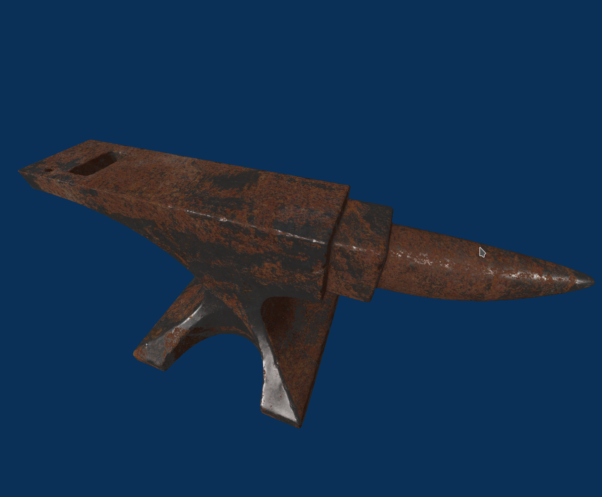
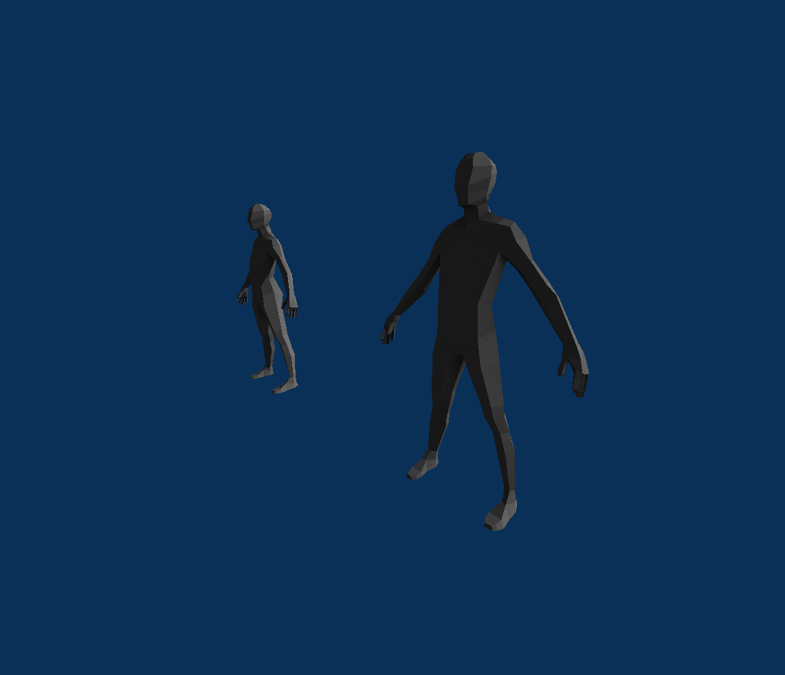
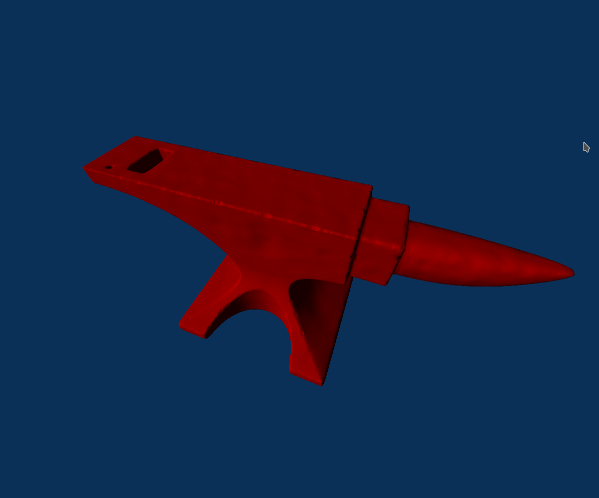

A very work-in-progress 3D game engine written to learn the fundamentals of game engine programming with very few dependencies. 

Features a Vulkan renderer, a multithreaded job system, basic skeletal animation, an X11 platform layer, a material/shader compiler, a game math library, and more.

